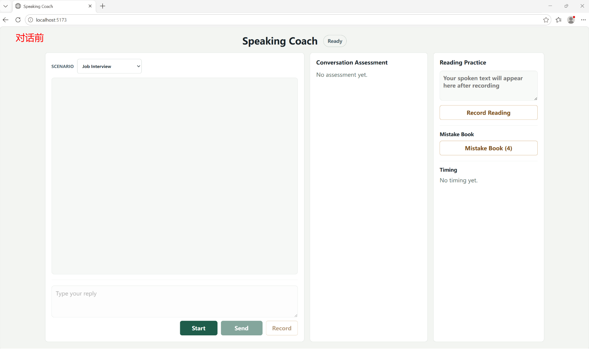
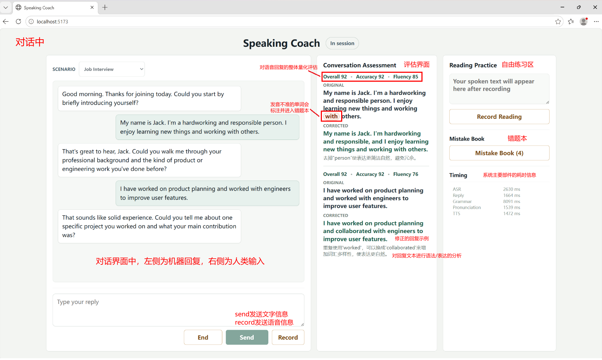
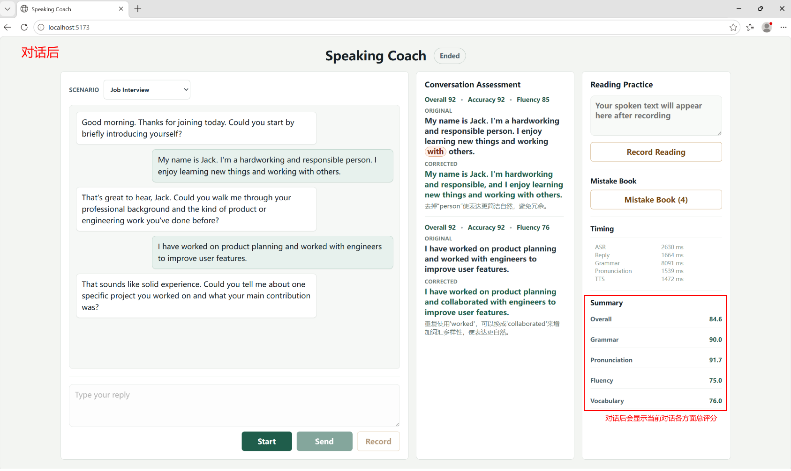
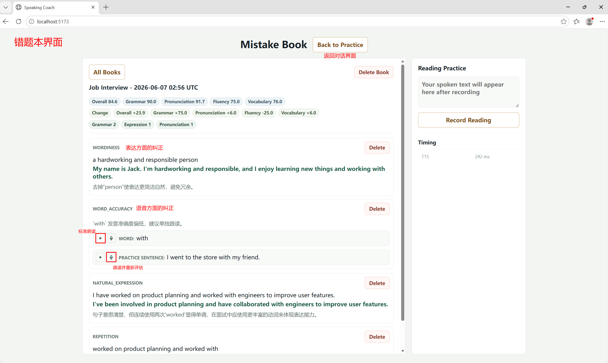

# AI 英语口语陪练

AI 英语口语陪练是一套面向英语口语场景训练的 Web 应用。用户可以选择面试、餐厅点餐、工作会议或自定义场景，与 AI 进行文字或语音对话；系统会在对话后给出语法/表达纠错、发音评测、会话总结，并把问题沉淀到错题本中用于复习。

## 演示视频

> **演示视频（B 站）**：[https://www.bilibili.com/video/BV1VQE86REma/](https://www.bilibili.com/video/BV1VQE86REma/)

本地演示视频：[video/speak_coach_intro.mp4](video/speak_coach_intro.mp4)

<video src="video/speak_coach_intro.mp4" controls width="100%"></video>

## 功能介绍

### 界面截图与使用流程

下面几张截图展示了一次完整练习从开始、对话中、结束总结到错题复习的流程。截图中的红色文字和红色方框是额外添加的讲解标注，用来说明关键区域和交互含义。

#### 对话前：选择场景并准备开始



进入系统后，页面处于 `Ready` 状态。左侧是主要对话区，可以先选择练习场景，例如 `Job Interview`；点击 `Start` 后会创建会话，并由 AI 先发出开场问题。中间的 `Conversation Assessment` 在对话前还没有评估结果，右侧提供独立的 `Reading Practice`、错题本入口和耗时信息区域。

#### 对话中：进行多轮对话并实时获得反馈



对话开始后，左侧消息区展示多轮练习内容：白色气泡是 AI 回复，绿色气泡是用户输入。底部输入框支持文字回复，`Send` 发送文本，`Record` 录制语音并交给后端做 ASR 转写。中间的 `Conversation Assessment` 会按轮次展示整体分、准确度、流利度、原句、修正句和中文解释；被标出的单词或表达代表系统发现的语法、表达或发音问题。右侧 `Timing` 记录 ASR、AI 回复、语法分析、发音评测和 TTS 等主要链路耗时，便于观察系统响应速度。

#### 对话后：生成本次练习总结



点击 `End` 后，会话进入 `Ended` 状态，系统保留完整对话、评估结果和错题，并在右侧生成 `Summary`。总结会汇总本次练习的综合表现，包括 `Overall`、`Grammar`、`Pronunciation`、`Fluency` 和 `Vocabulary` 等维度，方便用户快速了解本轮练习的强弱项。

#### 错题本：按会话复盘和跟读练习



错题本会把一次会话中出现的语法、表达和发音问题沉淀成可复习条目。顶部展示本次会话的综合分、各维度分数、相对历史变化，以及 `Grammar`、`Expression`、`Pronunciation` 数量。每条错题会给出问题类型、原始表达、推荐修正和中文解释；发音错题还提供标准朗读和跟读录音入口，用户可以针对单词或练习句再次录音评测。错题本页面也支持返回练习、删除单条错题或删除整本错题本。

### 对话面板

对话面板是主要练习入口，负责完成一次真实的场景对话。

- 场景选择：内置 `Job Interview`、`Restaurant Ordering`、`Work Meeting`，也支持 `Custom` 自定义英文练习场景。
- 会话控制：点击 `Start` 后 AI 先发起开场白，点击 `End` 结束本次练习并生成总结。
- 输入方式：支持文字发送，也支持浏览器麦克风录音；语音输入会先经过 ASR 转写，再进入对话链路。
- AI 回复：后端通过 LLM 根据当前场景、角色、目标表达和最近对话历史生成回复，并通过 WebSocket 流式返回到页面。
- 语音播放：默认使用浏览器 `speechSynthesis` 播放 AI 回复；产品正常使用不要求下载本地 TTS 模型。
- 对话反馈：`Conversation Assessment` 区域展示语法/表达修正和发音评测结果。纠错和发音评测是旁路异步执行，不阻塞 AI 继续对话。
- 阅读练习：`Reading Practice` 可独立录一句英文做发音评测，不依赖当前对话轮次。
- 性能与总结：侧边区域展示最近一轮 ASR、LLM、语法、发音、TTS 等耗时，以及本次会话的综合表现分数。

### 错题本

错题本按会话保存用户在练习中暴露的问题，用于复盘和跟读练习。

- 会话列表：按一次对话生成一本错题本，显示总错题数，以及 `Grammar`、`Expression`、`Pronunciation` 三类数量。
- 详情查看：进入某一本错题本后，可以按轮次查看当时的原句、修正版、中文解释和发音问题。
- 类型过滤：支持按语法、表达、发音筛选。
- 发音复习：发音错题会生成目标单词和练习句，用户可以播放标准读音，也可以再次录音跟读评测。
- 删除管理：支持删除单条错题、删除某一本错题本，也支持批量删除错题本。
- 进步趋势：错题详情中会展示本次会话分数，并和历史记录做简单对比。

## 构建与运行

### 环境要求

- Python 3.11+
- Node.js 18+ 和 npm
- ffmpeg，用于把浏览器录音转为 ASR 和腾讯云语音评测更稳定的 16kHz 单声道 WAV
- 一个 OpenAI-compatible LLM 接口，用于 AI 对话、语法/表达纠错、总结和自定义场景
- 腾讯云 SOE 语音评测配置，用于发音评分
- 本地 faster-whisper ASR 模型，用于把用户语音转文字

Linux 服务器可以这样安装 ffmpeg：

```bash
sudo apt-get update
sudo apt-get install -y ffmpeg
```

### 安装依赖

在项目根目录执行：

```bash
python3 -m pip install -e ".[dev,asr]"
cd frontend
npm install
cd ..
```

如果只想使用 Makefile，也可以执行：

```bash
make install-backend
python3 -m pip install -e ".[asr]"
make install-frontend
```

### 下载并放置 ASR 模型

产品运行只需要本地 ASR 模型。推荐下载 faster-whisper 兼容模型，并放到 `models/asr/` 下，例如：

```text
models/
  asr/
    faster-whisper-small.en/
      config.json
      model.bin
      tokenizer.json
      vocabulary.*
```

常用选择：

- `faster-whisper-tiny.en`：体积小，速度快，准确率较低。
- `faster-whisper-small.en`：推荐默认选择，速度和准确率较均衡。
- `faster-whisper-medium.en` / `faster-whisper-large`：准确率更高，但更吃 CPU/GPU。

本地模型准备好后，在 `.env` 中把 `ASR_MODEL_SIZE` 指向这个目录的绝对路径。

### 配置 `.env`

复制示例配置：

```bash
cp .env.example .env
```

然后至少配置下面这些项：

```bash
# 本地 ASR
ASR_PROVIDER=faster_whisper
ASR_MODEL_SIZE=/absolute/path/to/fluent-coach/models/asr/faster-whisper-small.en
ASR_DEVICE=cpu
ASR_COMPUTE_TYPE=int8

# OpenAI-compatible LLM
LLM_PROVIDER=openai_compatible
LLM_BASE_URL=https://your-llm-endpoint/v1
LLM_API_KEY=your_api_key
LLM_MODEL=your_model_name
LLM_TIMEOUT_SECONDS=30

# 腾讯云 SOE 发音评测
PRON_PROVIDER=tencent_soe
TENCENT_APP_ID=your_tencent_app_id
TENCENT_SECRET_ID=your_tencent_secret_id
TENCENT_SECRET_KEY=your_tencent_secret_key
TENCENT_SOE_WS_URL=wss://soe.cloud.tencent.com/soe/api
TENCENT_SOE_SERVER_ENGINE_TYPE=16k_en
TENCENT_SOE_EVAL_MODE=1
TENCENT_SOE_SCORE_COEFF=3.0

# 普通语音对话中开启每轮发音评测；真实 provider 默认也会开启，这里显式写出便于排查。
PRON_ASSESS_AUDIO_TURNS=1

# 产品默认使用浏览器 TTS，不需要本地 TTS 模型。
TTS_PROVIDER=browser

# 本地存储位置，可按需调整。
APP_DB_PATH=.local/speaking_coach.sqlite
APP_AUDIO_DIR=.local/audio
```

如果服务器有 CUDA，可把 ASR 改为：

```bash
ASR_DEVICE=cuda
ASR_COMPUTE_TYPE=float16
```

注意：`TENCENT_APP_ID` 是腾讯云应用的 APPID，不是 UIN 或主账号 ID。

### 启动服务

终端 1 启动后端：

```bash
make dev-backend
```

后端默认监听：

```text
http://127.0.0.1:8000
```

终端 2 启动前端：

```bash
make dev-frontend
```

前端默认监听：

```text
http://127.0.0.1:5173
```

浏览器打开：

```text
http://localhost:5173/
```

Vite 会把 `/api` 和 `/ws` 自动代理到本地 FastAPI 后端。

### 在服务器上访问

如果后端和前端运行在服务器上，推荐使用 SSH 端口转发：

```bash
ssh -L 5173:127.0.0.1:5173 -L 8000:127.0.0.1:8000 <user>@<server-public-ip>
```

然后在本地浏览器打开：

```text
http://localhost:5173/
```

如果你已经做了服务器端口映射，也可以直接访问映射后的前端端口。浏览器麦克风通常要求 HTTPS 或 `localhost` 安全上下文；通过 SSH 转发到本地 `localhost` 最省事。

### 常用检查命令

检查后端健康状态：

```bash
curl http://127.0.0.1:8000/api/health
```

检查本地 ASR：

```bash
ASR_PROVIDER=faster_whisper \
ASR_MODEL_SIZE=/absolute/path/to/fluent-coach/models/asr/faster-whisper-small.en \
python3 scripts/test_asr_provider.py
```

检查腾讯云 SOE：

```bash
python3 scripts/test_tencent_soe.py
```

运行项目测试：

```bash
make test
```

## 项目技术架构

整体分为浏览器前端、FastAPI 后端、模型/云服务 provider、本地 SQLite 存储四层。

```text
浏览器 React UI
  -> REST /api/scenarios, /api/sessions, /api/mistake-books, /api/progress
  -> WebSocket /ws/sessions/{session_id}/audio
  -> 浏览器麦克风录音 / 浏览器 speechSynthesis 播放

FastAPI 后端
  -> session / turn / summary / mistake book API
  -> audio 保存与 ffmpeg 转码
  -> ASR provider: faster-whisper 本地识别
  -> LLM provider: OpenAI-compatible 对话、纠错、总结
  -> pronunciation provider: 腾讯云 SOE 发音评测
  -> TTS provider: browser 默认，OpenAI-compatible 可选，本地 Kokoro 仅用于 bench

本地数据
  -> .local/speaking_coach.sqlite 保存会话、轮次、纠错、发音评测、错题、总结
  -> .local/audio 保存用户录音和转码后的 wav
```

一轮语音对话的数据流：

```text
用户点击 Record
  -> 浏览器 MediaRecorder 采集音频
  -> WebSocket 上传 audio.chunk / end_turn
  -> 后端保存音频并用 ffmpeg 转 16kHz mono wav
  -> faster-whisper 整句 ASR
  -> 保存用户 turn
  -> LLM 根据场景、角色和历史生成 AI 回复
  -> WebSocket 流式返回 reply.delta / reply.done
  -> 前端展示 AI 回复并播放 TTS
  -> 后端异步执行语法/表达纠错和腾讯云发音评测
  -> 保存错题和评测结果
  -> 前端刷新 Conversation Assessment、Mistake Book、Summary、Timing
```

错题本的数据流：

```text
语法/表达纠错结果 + 发音低分词
  -> mistake_service 归类为 grammar / expression / pronunciation
  -> SQLite 按 session_id 和 turn_id 保存
  -> /api/mistake-books 返回会话级错题本
  -> 前端按会话、轮次和错误类型展示
  -> 发音错题可再次录音，走 /api/pronunciation/practice/upload 单独评测
```

主要目录：

```text
frontend/                  React + Vite 前端
backend/app/main.py         FastAPI API 与 WebSocket 主入口
backend/app/services/       ASR、LLM、语法、发音、错题、总结、存储等服务
backend/app/models/         Pydantic 数据模型
backend/app/testkit/        自动化 bench 测试框架
scripts/                    启动、smoke、bench 和 provider 检查脚本，见 scripts/README.md
fixtures/                   离线测试样例
docs/                       更详细的系统说明、计划和 bench 文档，见 docs/README.md
models/asr/                 本地 ASR 模型目录
models/tts/                 本地 TTS 模型目录，仅自动化 bench 需要
```

## 全自动测试框架

项目内置了一个后端 bench 框架，用来自动跑多轮 WebSocket 对话并生成报告。它不是产品页面，也不是普通单元测试；它主要用于验证真实语音链路、延迟和纠错效果。

核心入口：

```text
scripts/run_conversation_bench.py  跑一次 bench，写 JSON 和 Markdown 报告
scripts/bench_dashboard.py         启动只读 dashboard 查看多次 bench
backend/app/testkit/               bench 数据模型、WebSocket driver、报告、dashboard 后端
```

支持的主要模式：

- `offline_fake`：默认离线模式，使用固定用户台词、FakeASR、FakeLLM 和 mock 发音评测，适合快速检查 WebSocket 协议和报告生成。
- `real`：使用真实 provider 和指定音频文件/目录，适合检查真实 ASR、LLM、腾讯 SOE 链路。
- `grammar_tts`：全自动语法 bench。LLM 生成“面试者/顾客/团队成员”的下一句干净回复，框架自动注入语法错误，再用本地 TTS 合成音频，送进真实 ASR/LLM/grammar 链路，最后统计系统是否识别并纠正了预期错误。

离线跑一次：

```bash
python3 scripts/run_conversation_bench.py --scenario interview --turns 10
```

可选场景：

```text
interview
restaurant_ordering
meeting
```

启动 dashboard：

```bash
python3 scripts/bench_dashboard.py
```

浏览器打开：

```text
http://localhost:8100/
```

如果 8100 已经被占用，通常说明 dashboard 已经在跑；也可以换端口：

```bash
BENCH_DASHBOARD_PORT=8101 python3 scripts/bench_dashboard.py
```

dashboard 主要面板：

- `Runs`：左侧列表，每行是一轮 bench run。
- `Summary`：本次 run 的场景、模式、provider、轮数和核心指标。
- `Latency`：ASR、LLM 首 token、token 间隔、语法分析、发音评测、TTS 等耗时分位数。
- `Turns`：逐轮对话明细。页面会按场景显示角色，例如面试场景是“面试官 / 面试者”，会议场景是“项目负责人 / 团队成员”。

`grammar_tts` 模式需要额外的本地 TTS 模型，这只用于自动化测试，不是产品运行必需项。团队内部完整命令示例：

```bash
APP_DB_PATH=/tmp/grammar-tts.sqlite \
APP_AUDIO_DIR=/tmp/grammar-tts-audio \
ASR_PROVIDER=faster_whisper \
ASR_MODEL_SIZE=/absolute/path/to/fluent-coach/models/asr/faster-whisper-small.en \
ASR_DEVICE=cpu \
ASR_COMPUTE_TYPE=int8 \
LLM_PROVIDER=openai_compatible \
LLM_BASE_URL=https://your-llm-endpoint/v1 \
LLM_API_KEY=your_api_key \
LLM_MODEL=your_model_name \
PRON_ASSESS_AUDIO_TURNS=0 \
TTS_PROVIDER=kokoro \
KOKORO_MODEL_DIR=/absolute/path/to/fluent-coach/models/tts/Kokoro-82M \
python3 scripts/run_conversation_bench.py \
  --mode grammar_tts \
  --scenario meeting \
  --turns 10 \
  --output-dir /tmp/grammar-tts-report
```

对应 dashboard：

```bash
BENCH_RUNS_DIR=/tmp/grammar-tts-report/runs \
APP_AUDIO_DIR=/tmp/grammar-tts-audio \
python3 scripts/bench_dashboard.py
```

更详细的测试框架字段解释见 [docs/bench-framework-guide.md](docs/bench-framework-guide.md)。

## 更多文档

- [README.dev.md](README.dev.md)：开发者 README，包含 PR 规范、fixtures 维护、测试命令和 provider 底层说明。
- [docs/README.md](docs/README.md)：文档索引，说明 docs 下各设计、计划和调研文档的用途。
- [scripts/README.md](scripts/README.md)：脚本索引，说明 scripts 下各工具的用途和常用命令。
- [docs/user-facing-system-guide.md](docs/user-facing-system-guide.md)：更细的用户视角系统说明和错题标签解释。
- [docs/bench-framework-guide.md](docs/bench-framework-guide.md)：自动化 bench 框架结构、运行方式和 dashboard 字段说明。
